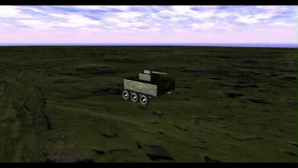

# Computer Graphics Course Project

A Computer Graphics course project developed in **C++** using **Visual Studio**.

## Demo

<p align="center">
  
</p>

## Requirements

Before running this project, make sure you have:

- Microsoft Visual Studio 2019 or later
- Desktop development with C++ workload installed
- Windows operating system

## Project Structure

```
.
├── basicsource/
├── resources/
├── shaders/
├── support/
├── objects-standard/
├── objects-student/
├── assig2.sln
├── assig2.vcxproj
└── ...
```

## How to Run

1. Clone the repository.

```bash
git clone https://github.com/your-username/your-repository.git
```

2. Open **`assig2.sln`** in Visual Studio.

3. If prompted, allow Visual Studio to retarget the project.

4. Select **Debug** or **Release** configuration.

5. Press **Ctrl + F5** (or click **Local Windows Debugger**) to build and run the application.

## Notes

- This project was created as part of a Computer Graphics course.
- Resource folders (`resources`, `shaders`, `objects-*`) must remain in their original locations.
- If assets are missing, verify that the project is opened from the repository root.

## Technologies

- C++
- Visual Studio
- OpenGL (course framework)

## Author

Arslan Rejepov
